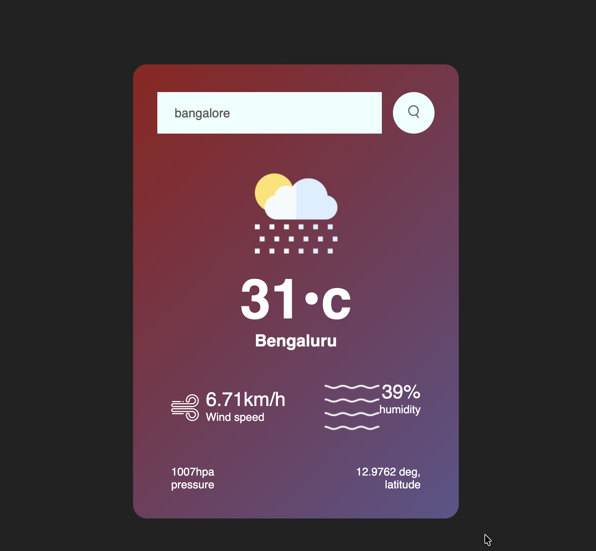

# 🌦️ Weather App

## 📌 Overview

A simple and responsive weather application that allows users to search for any city and get real-time weather information.

## ✨ Features

* 🔍 Search weather by city name
* 🌡️ Display temperature (°C)
* 💧 Humidity information
* 🌬️ Wind speed
* 📊 Pressure data
* 📍 Location coordinates

---

## 🛠️ Tech Stack

* HTML
* CSS
* JavaScript
* OpenWeatherMap API

## ⚙️ How It Works

* User enters a city name
* App sends a request to the weather API using `fetch()`
* Data is received asynchronously
* UI updates dynamically using DOM manipulation


## 🚀 Setup Instructions

### 1. Clone the repository

```bash
git clone https://github.com/tusharcode007/weather-app.git
cd weather-app
```

### 2. Open the project

Just open `index.html` in your browser

---

## 🔑 API Used

* OpenWeatherMap API

---

## 📸 Screenshot

# 🌦️ Weather App

## 📌 Overview

A simple and responsive weather application that allows users to search for any city and get real-time weather information.

---

## ✨ Features

* 🔍 Search weather by city name
* 🌡️ Display temperature (°C)
* 💧 Humidity information
* 🌬️ Wind speed
* 📊 Pressure data
* 📍 Location coordinates

---

## 🛠️ Tech Stack

* HTML
* CSS
* JavaScript
* OpenWeatherMap API

---

## ⚙️ How It Works

* User enters a city name
* App sends a request to the weather API using `fetch()`
* Data is received asynchronously
* UI updates dynamically using DOM manipulation

---

## 🚀 Setup Instructions

### 1. Clone the repository

```bash
git clone https://github.com/your-username/weather-app.git
cd weather-app
```

### 2. Open the project

Just open `index.html` in your browser

---

## 🔑 API Used

* OpenWeatherMap API

---

## 📸 Screenshot


---

## 🔥 Key Learning
- Learned async/await and API handling
- Understood DOM manipulation
- Built real-time data fetching app

## 🧑‍💻 Author

R S TUSHAR


